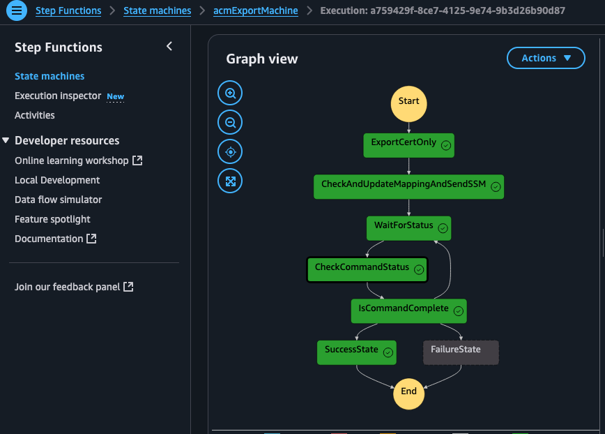

# ACM Certificate Export and Renewal Automation

> **Note:** This is a sample project for demonstration and learning purposes.

This project demonstrates how to automate the process of exporting Amazon Certificate Manager (ACM) certificates and installing them on EC2 instances and on-premises servers. It also showcases automated certificate renewal, creating a seamless, event-driven workflow that requires minimal manual intervention.

## 🎯 Learning Objectives

* Implement secure certificate management using AWS services
* Build event-driven automation with Step Functions and EventBridge
* Apply tag-based targeting for EC2 instance management
* Implement attribute-based access control (ABAC) for security
* Create a complete serverless workflow with proper error handling

## 📋 Table of Contents

- [Solution Overview](#️-solution-overview)
- [Architecture Components](#-architecture-components)
- [On-Demand Certificate Deployment](#-on-demand-certificate-deployment)
- [Automated Certificate Renewal](#-automated-certificate-renewal)
- [Step Function Details](#-step-function-details)
- [Setup Instructions](#️-setup-instructions)
- [Testing the Solution](#-testing-the-solution)
- [Quickstart with CloudFormation](#-quickstart-with-cloudformation)
- [Monitoring and Notifications](#-monitoring-and-notifications)

## 🏗️ Solution Overview

The solution consists of two main parts:

1. **Export and Install**: Triggered via API Gateway to export certificates from ACM and install them on EC2 or on-premises servers
2. **Certificate Renewal**: Automatically handles certificate renewals via EventBridge events

### End-to-End Flow

1. **Certificate Export Request**: The process begins with a request to export a certificate from ACM
2. **Passphrase Generation**: The system automatically generates a secure passphrase (not provided by the user)
3. **Secret Storage**: The generated passphrase is stored in AWS Secrets Manager with appropriate tags
4. **Certificate Export**: ACM exports the certificate using the generated passphrase
5. **DynamoDB Update**: Certificate metadata and target information are stored in DynamoDB
6. **SSM Command**: The system triggers an SSM command targeting EC2 instances with matching tags
7. **Certificate Installation**: Target EC2 instances retrieve the passphrase from Secrets Manager, decrypt the private key, and install the certificate files
8. **Automatic Renewal**: When certificates are renewed in ACM, the system automatically detects the event and repeats the process

### On-Demand Certificate Deployment Flow


1. **Initiate Certificate Issuance**: The user triggers the certificate issuance process, ensuring that the certificate is in the "issued" state before proceeding.
2. **API Triggers Step Function**: An API call triggers a Step Function to begin the certificate installation cycle.
3. **Invoke ACM Export Lambda**: The Step Function calls the first step, invoking the acm-export Lambda, which generates a passphrase and securely stores it in AWS Secrets Manager.
4. **Export Certificate**: The acm-export Lambda uses the generated passphrase to export the ACM certificate, completing the first step of the export process.
5. **Invoke SSM Run Lambda**: The Step Function invokes the ssm-run Lambda, passing the secret name, passphrase, encrypted private key, and public key to the next step in the cycle, as provided by the acm-export Lambda.
6. **Update DynamoDB**: The ssm-run Lambda updates the DynamoDB table with relevant details, including the certificate ARN, certificate name, tag values, issuance date, and expiration date.
7. **Execute SSM Automation Document**: The ssm-run Lambda triggers an SSM automation document, running commands to install the certificate by passing the public key, encrypted private key, and the secret alias of the passphrase.
8. **Install Certificate on EC2 Instances**: The SSM automation document executes the installation of the certificates and the private key on the EC2 instances, while also validating the passphrase. (Customer can enhance these steps as they use the sample)
9. **Wait for SSM Deployment Completion**: The Lambda status check waits for SSM to complete the certificate deployment across all EC2 instances before concluding the Step Function.

### Automated Certificate Renewal Flow


1. **EventBridge Triggers Certificate Renewal**: An EventBridge event is triggered, confirming that the certificate has been renewed.
2. **Invoke Renewal Lambda**: The EventBridge event invokes the renew-acm Lambda function, which initiates the renewal process.
3. **Invoke ACM Export Lambda**: The Step Function invokes the acm-export Lambda, which generates a passphrase and securely stores it in AWS Secrets Manager.
4. **Export Renewed Certificate**: The acm-export Lambda uses the generated passphrase to export the renewed ACM certificate, completing the export process.
5. **Invoke SSM Run Lambda**: The Step Function invokes the ssm-run Lambda, passing the secret name, passphrase, encrypted private key, and public key to the next step in the cycle, as provided by the acm-export Lambda.
6. **Update DynamoDB**: The ssm-run Lambda updates the DynamoDB table with relevant details, including the certificate ARN, certificate name, tag values, issuance date, and expiration date for the renewed certificate.
7. **Execute SSM Automation Document**: The ssm-run Lambda triggers an SSM automation document, running commands to install the renewed certificate by passing the public key, encrypted private key, and the secret alias of the passphrase.
8. **Install Certificate on EC2 Instances**: The SSM automation document executes the installation of the renewed certificate and the private key on the EC2 instances, while also validating the passphrase.
9. **Wait for SSM Deployment Completion**: The Lambda status check waits for SSM to complete the certificate deployment across all EC2 instances before concluding the Step Function.

## 🧩 Architecture Components

* **API Gateway** - Accepts requests to export and install certificates
* **ACM (Amazon Certificate Manager)** - Source of certificates and renewal events
* **Amazon EventBridge** - Listens for certificate renewal events
* **Lambda Functions**:
  * `renewACMCert` - Handles renewal events and starts the Step Function
  * `acm-Export` - Exports certificates from ACM
  * `checkAndUpdateMappingAndSendSSM` - Updates DynamoDB and triggers SSM automation
  * `checkCommandStatus` - Monitors SSM command execution
* **Step Function** - Orchestrates the export and installation process
* **DynamoDB (CertTagMapping)** - Stores certificate metadata and target information using a composite key structure:
  * `TagKeyValue` (Partition Key) - Combination of tag key and value for efficient querying by tag
  * `CertificateArn#CertName` (Sort Key) - Enables range queries on certificate ARNs
* **Secrets Manager** - Securely stores certificate passphrases
* **SSM** - Runs the enhanced `Install-ACMCertificate` document to securely install certificates on targets

## 🔄 On-Demand Certificate Deployment

This workflow is initiated through an API Gateway call with the following input:

```json
{
  "CertificateArn": "arn:aws:acm:us-east-1:1234567890123:certificate/8106d6b2-f204-4354-8893-d49e311b3900",
  "CertName": "acmDemoCertName",
  "TargetTagKey": "env",
  "TargetTagValue": "dev"
}
```

The API Gateway triggers a Step Function with the following steps:

1. **acm-Export**:
   * Exports the certificate from ACM using the provided ARN and passphrase
   * Converts the certificate, private key, and chain to Base64 format
   * Passes the encoded data to the next step

2. **checkAndUpdateMappingAndSendSSM**:
   * Updates or creates an entry in the DynamoDB table with:
     ```
     'CertificateArn': cert_arn,
     'Passphrase': passphrase,
     'CertName': cert_name,
     'TargetTagKey': tag_key,
     'TargetTagValue': tag_value,
     'CertExpiryDate': cert_not_after,
     'LastExportedDate': datetime.utcnow().isoformat() + 'Z'
     ```
   * Runs the SSM automation document `Install-ACMCertificate` targeting EC2 or on-premises servers using the specified tags

3. **checkCommandStatus**:
   * Monitors the SSM command execution
   * Reports success or failure of the installation

## 🔄 Automated Certificate Renewal

This workflow is triggered automatically when ACM renews a certificate:

1. **EventBridge Rule** matches the following event pattern:
   ```json
   {
     "source": ["aws.acm"],
     "detail-type": ["ACM Certificate Available"],
     "detail": {
       "Action": ["RENEWAL"],
       "CertificateType": ["AMAZON_ISSUED"],
       "Exportable": [true]
     }
   }
   ```

2. **renewACMCert Lambda** is triggered:
   * Extracts the certificate ARN from the event
   * Queries the DynamoDB table to retrieve the associated metadata:
     ```
     "CertificateArn": cert_arn,
     "CertName": item.get("CertName"),
     "Passphrase": item.get("Passphrase"),
     "TargetTagKey": item.get("TargetTagKey"),
     "TargetTagValue": item.get("TargetTagValue")
     ```
   * Starts the same Step Function used in the On-Demand Certificate Deployment with this data

3. The **Step Function** then follows the same process as in the On-Demand Certificate Deployment to export and install the renewed certificate.

## 🧠 Step Function Details

The Step Function (`acmExportMachine.json`) orchestrates the certificate export and installation process. Here's the actual Step Function definition:

```json
{
  "StartAt": "ExportCertOnly",
  "States": {
    "ExportCertOnly": {
      "Type": "Task",
      "Resource": "arn:aws:lambda:us-east-1:1234567890123:function:acm-Export",
      "Next": "CheckAndUpdateMappingAndSendSSM"
    },
    "CheckAndUpdateMappingAndSendSSM": {
      "Type": "Task",
      "Resource": "arn:aws:lambda:us-east-1:1234567890123:function:checkAndUpdateMappingAndSendSSM",
      "Next": "WaitForStatus"
    },
    "WaitForStatus": {
      "Type": "Wait",
      "Seconds": 15,
      "Next": "CheckCommandStatus"
    },
    "CheckCommandStatus": {
      "Type": "Task",
      "Resource": "arn:aws:lambda:us-east-1:1234567890123:function:checkCommandStatus",
      "Next": "IsCommandComplete"
    },
    "IsCommandComplete": {
      "Type": "Choice",
      "Choices": [
        {
          "Variable": "$.Status",
          "StringEquals": "Success",
          "Next": "SuccessState"
        },
        {
          "Variable": "$.Status",
          "StringEquals": "Failed",
          "Next": "FailureState"
        }
      ],
      "Default": "WaitForStatus"
    },
    "SuccessState": {
      "Type": "Succeed"
    },
    "FailureState": {
      "Type": "Fail",
      "Error": "SSMCommandFailed",
      "Cause": "The SSM command execution failed"
    }
  }
}
```

### Step Function Flow

```
Start
 └──► ExportCertOnly (acm-Export Lambda)
       ↓
    CheckAndUpdateMappingAndSendSSM (Lambda)
       ↓
       WaitForStatus (Wait 15s)
       ↓
    CheckCommandStatus (Lambda)
       ↓
 ┌─────► IsCommandComplete? (Choice)
 │            ├──► SuccessState (Succeed)
 │            └──► FailureState (Fail)
 └─────────────► WaitForStatus (loop back if still InProgress)
```

### Benefits

| Feature                         | Benefit                                          |
| ------------------------------- | ------------------------------------------------ |
| Tag-based targeting             | Works with both EC2 and on-premises servers      |
| Central certificate management  | All certificate metadata stored in DynamoDB      |
| Fully automated renewals        | No manual intervention needed for renewals       |
| SSM automation                  | Consistent installation across environments      |
| Step Function orchestration     | Reliable execution with visibility and logging   |


## ✅ Prerequisites

Before setting up this solution, ensure you have:

* AWS CLI configured with appropriate permissions
* An AWS account with access to ACM, Lambda, Step Functions, DynamoDB, and SSM
* At least one ACM certificate that you want to export
* One or more EC2 instances with SSM Agent installed
* Proper IAM permissions to create all required resources

## 🛠️ Setup Instructions

1. **DynamoDB Setup**:
   - Create a `CertTagMapping` table with the following structure:
     - Partition key: `TagKeyValue` (String)
     - Sort key: `CertificateArn#CertName` (String)
   - Additional fields: `CertificateArn`, `CertName`, `TargetTagKey`, `TargetTagValue`, `Passphrase`, `CertExpiryDate`, `LastExportedDate`

2. **Lambda Functions**:
   - Deploy the following Lambda functions:
     - `renewACMCert` - Set environment variables `CERT_TAG_TABLE` and `STATE_MACHINE_ARN`
     - `acm-Export`
     - `checkAndUpdateMappingAndSendSSM`
     - `checkCommandStatus`

3. **Step Function**:
   - Deploy the Step Function using the state machine definition in `step_func/acmExportMachine.json`
   - Use the exact ARNs as shown in the JSON definition or update them to match your deployed functions:
     ```
     arn:aws:lambda:us-east-1:1234567890123:function:acm-Export
     arn:aws:lambda:us-east-1:1234567890123:function:checkAndUpdateMappingAndSendSSM
     arn:aws:lambda:us-east-1:1234567890123:function:checkCommandStatus
     ```

4. **API Gateway**:
   - Create an API Gateway endpoint that triggers the Step Function for manual certificate export and installation

5. **EventBridge Rule**:
   - Create a rule named `ACM_PubCert_Renewed` to match ACM certificate renewal events
   - Set the target to the `renewACMCert` Lambda

6. **SSM Document**:
   - Create an SSM document named `Install-ACMCertificate` that handles certificate installation on target servers

7. **IAM Permissions**:
   - Ensure Lambda functions have appropriate permissions:
     - ACM: `ExportCertificate`, `DescribeCertificate`
     - DynamoDB: Read/Write to `CertTagMapping`
     - SSM: `SendCommand`, `ListCommandInvocations`
     - Step Functions: `StartExecution`

## 🧪 Testing the Solution

### Testing On-Demand Certificate Deployment

Make an API call to your API Gateway endpoint with the following payload:

```json
{
  "CertificateArn": "arn:aws:acm:us-east-1:1234567890123:certificate/8106d6b2-f204-4354-8893-d49e311b3900",
  "CertName": "academe",
  "TargetTagKey": "env",
  "TargetTagValue": "dev"
}
```

### Testing Automated Certificate Renewal

You can test the renewal process by manually triggering an EventBridge event using the AWS CLI:

```bash
aws events put-events --entries '[
  {
    "Source": "custom.aws.acm",
    "DetailType": "ACM Certificate Available",
    "Detail": "{\"Action\": \"RENEWAL\", \"CertificateType\": \"AMAZON_ISSUED\", \"CommonName\": \"example.cipherclouds.com\", \"DomainValidationMethod\": \"DNS\", \"CertificateCreatedDate\": \"2025-05-18T02:22:05Z\", \"CertificateExpirationDate\": \"2026-06-16T23:59:59Z\", \"DaysToExpiry\": 395, \"InUse\": false, \"Exported\": true}",
    "Resources": [
      "arn:aws:acm:us-east-1:1234567890123:certificate/0762eb4c-f9a8-4cf2-bfd6-7715ff743942"
    ],
    "EventBusName": "default"
  }
]' --region us-east-1
```

Make sure the certificate ARN exists in your DynamoDB table before testing.


## 🚀 Quickstart with CloudFormation

Deploy the solution quickly using the provided CloudFormation template:

### Deployment Steps

1. **Deploy the CloudFormation stack**:
   ```bash
   aws cloudformation deploy \
     --stack-name acm-cert-export \
     --template-file infra/cloudformation/acm-cert-export-setup.yaml \
     --capabilities CAPABILITY_IAM
   ```
   This template includes:
   - Enhanced DynamoDB table with composite key structure
   - Secure SSM document for certificate installation
   - Automatic certificate renewal via EventBridge
   - IAM roles with least privilege permissions
2. **Tag your target EC2 instances where certificates should be installed**:
   ```bash
    aws ec2 create-tags \
    --resources i-1234567890abcdef0 \
    --tags Key=env,Value=dev
3. **Get the API Gateway endpoint URL from CloudFormation outputs**
4. **Create a payload file (payload.json) with your certificate details:**
    ```json
      {
        "CertificateArn": "arn:aws:acm:us-east-1:123456789012:certificate/your-cert-id",
        "CertName": "my-cert",
        "TargetTagKey": "env",
        "TargetTagValue": "dev"
      }
5. **Invoke the API to export and install the certificate:**
  ```bash
      awscurl -X POST https://your-api-id.execute-api.us-east-1.amazonaws.com/prod/export-cert \
      -H "Content-Type: application/json" \
      -d @payload.json
  ```

6. **Monitor the execution in the Step Functions console to see the certificate export and installation progress.**

## Important Notes  

  * Target EC2 instances must be running Linux and have SSM Agent installed

  * Certificates are installed in /etc/ssl/certs/ and /etc/ssl/private/ folders
  
  * The API Gateway is secured with IAM authentication
  
  * Each certificate requires a one-to-one mapping with EC2 instance tags
  
  * You can customize the installation paths by modifying the SSM document

## EC2 IAM Policy Requirements

EC2 instances that receive certificates must have an IAM role with the following policy to enable Attribute-Based Access Control (ABAC) for accessing certificate passphrases:

```json
{
    "Version": "2012-10-17",
    "Statement": [
        {
            "Sid": "AllowGetSecretWhenEnvMatches",
            "Effect": "Allow",
            "Action": [
                "secretsmanager:GetSecretValue",
                "secretsmanager:DescribeSecret"
            ],
            "Resource": "arn:aws:secretsmanager:[REGION]:[ACCOUNT_ID]:secret:acm-passphrase/*",
            "Condition": {
                "StringEquals": {
                    "secretsmanager:ResourceTag/env": "${aws:PrincipalTag/env}"
                }
            }
        }
    ]
}
```

This ABAC policy ensures that:
- EC2 instances can only access secrets with matching environment tags
- The SSM automation can retrieve the passphrase to decrypt the private key during installation
- Security is maintained through tag-based access control

## SSM Certificate Installation Flow

The SSM document (`Install-ACMCertificate`) performs the following steps:

1. **Temporary Workspace Creation**:
   - Creates a secure temporary directory (`/tmp/${CERT_NAME}`) for processing certificate files

2. **Certificate File Preparation**:
   - Decodes the Base64-encoded certificate components
   - Stores them temporarily in the secure workspace

3. **Passphrase Retrieval**:
   - Uses the EC2 instance's IAM role to retrieve the certificate passphrase from Secrets Manager
   - The EC2 role must have the appropriate ABAC policy as described above

4. **Private Key Decryption**:
   - Decrypts the encrypted private key using the retrieved passphrase
   - Uses OpenSSL for secure key unwrapping

5. **File Installation**:
   - Installs certificate and chain to `/etc/ssl/certs/[CertName]-fullchain.pem` and `/etc/ssl/certs/[CertName]-chain.pem`
   - Installs decrypted private key to `/etc/ssl/private/[CertName]-privkey.pem`
   - Sets appropriate permissions (644 for certificates, 600 for private key)
   - Sets ownership to root:root

6. **Cleanup**:
   - Securely removes all temporary files

This process can be customized by modifying the SSM document to use different paths or permissions as needed for your specific application requirements.


## Successful Execution Flow


## 🔔 Monitoring and Notifications

* Monitor Step Function executions through CloudWatch Logs and the AWS Step Functions console
* Set up CloudWatch Alarms for failed Step Function executions
* Consider adding SNS notifications for failed certificate installations or renewals

## ⚠️ Limitations and Considerations

This sample project has the following limitations to be aware of:

* Only works with ACM certificates that have the "Exportable" flag set to true
* Requires EC2 instances to have SSM Agent installed and proper IAM permissions
* Certificate private keys are temporarily stored in memory during the export process
* The solution is region-specific; cross-region deployments require additional configuration
* Error handling is basic and may require enhancement for production use
* No built-in monitoring dashboard (relies on CloudWatch)

## 📚 Further Reading

To learn more about the technologies used in this sample project:

* [AWS Certificate Manager Documentation](https://docs.aws.amazon.com/acm/)
* [AWS Step Functions Documentation](https://docs.aws.amazon.com/step-functions/)
* [AWS Systems Manager Documentation](https://docs.aws.amazon.com/systems-manager/)
* [Attribute-Based Access Control (ABAC) with AWS](https://docs.aws.amazon.com/IAM/latest/UserGuide/introduction_attribute-based-access-control.html)
* [AWS Secrets Manager Documentation](https://docs.aws.amazon.com/secretsmanager/)

---
